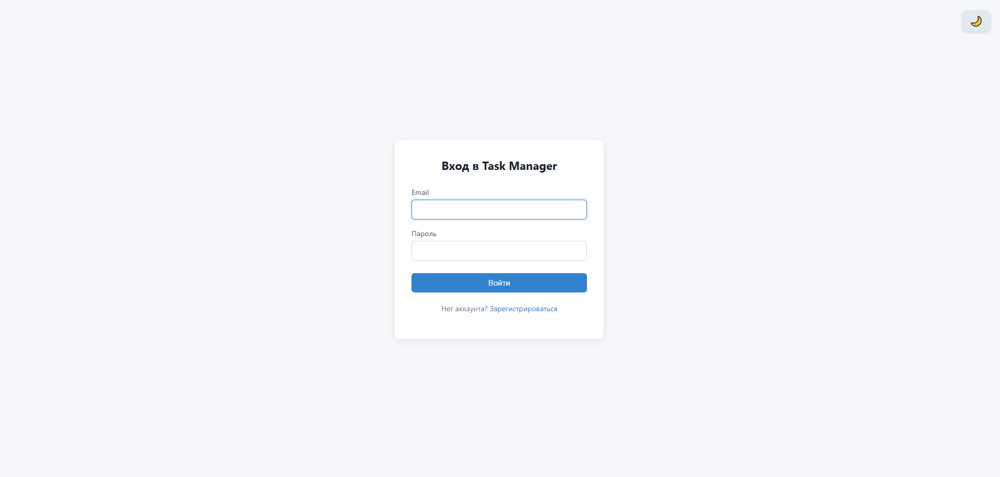
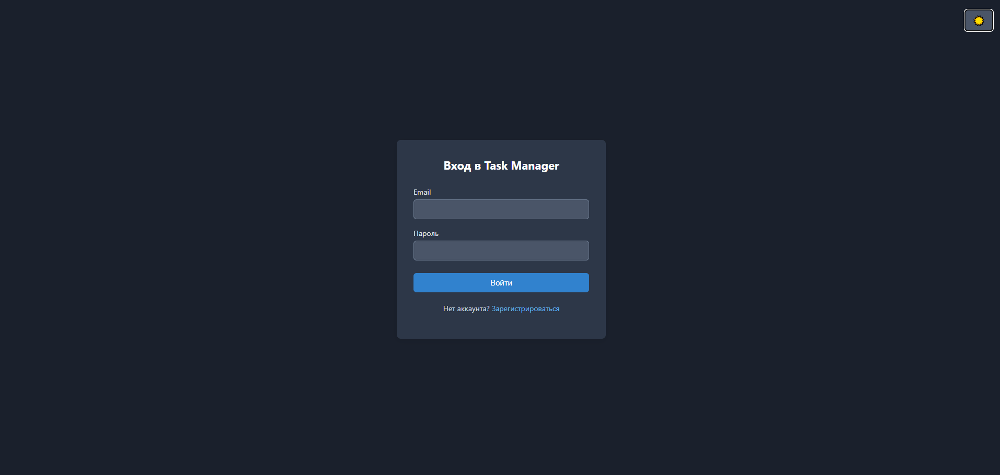
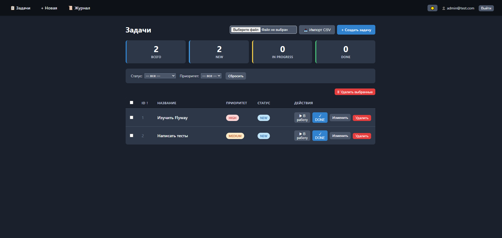
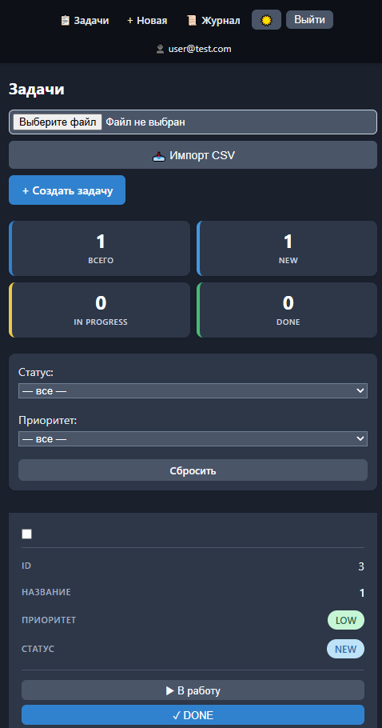

<div align="center">



# Task Manager

**REST API + веб-интерфейс для управления задачами**

[](https://openjdk.org/)
[](https://spring.io/projects/spring-boot)
[](https://www.postgresql.org/)
[](https://www.docker.com/)

[Быстрый старт](#быстрый-старт) · [Возможности](#возможности) · [REST API](#rest-api) · [Стек](#стек)

</div>

---

## Возможности

### Аутентификация и доступ

- **JWT**: `register`, `login`, `refresh`, `logout`.
- **Роли**: `ADMIN` видит все задачи, `USER` — только свои.
- **Refresh tokens** хранятся в БД и удаляются при logout.

### Управление задачами

- **CRUD**: создание, редактирование, удаление и смена статуса.
- **Поиск** по `title` и `description`.
- **Фильтрация** по статусу и приоритету.
- **Пагинация и сортировка** списков задач.
- **Статистика** по статусам.
- **Импорт / экспорт CSV**.
- **Массовое удаление** через чекбоксы.

### Веб-интерфейс

- Страницы на **Thymeleaf**: дашборд, список, детали, формы создания и редактирования.
- **Тёмная тема**, выбор сохраняется в `localStorage`.
- **Адаптивная вёрстка**: на мобильных вместо таблицы отображаются карточки.
- Журнал действий пользователя.

### Инфраструктура и качество

- **Spring Security** + `BCrypt` для хранения паролей.
- **AOP**: логирование и замер времени методов `TaskService`.
- **Audit log**: история изменений с деталями.
- **Swagger UI / OpenAPI**: автоматическая документация REST API.
- **Flyway**: версионированные миграции схемы БД.
- **Тесты**: unit, slice-тесты и интеграционные сценарии.
- **Фоновые задачи и оптимизации**: `@Scheduled`, `@Async`, `@Cacheable`.
- **Docker Compose**: запуск PostgreSQL и приложения одной командой.

---

## Требования

- Java **21+**
- Maven или встроенный wrapper `./mvnw`
- Docker и Docker Compose — только для запуска с PostgreSQL

---

## Быстрый старт

### Локально (H2, без Docker)

```bash
git clone <твой-репозиторий>
cd taskmanager
./mvnw spring-boot:run
```

Для Windows:

```bat
mvnw.cmd spring-boot:run
```

Открой браузер: <http://localhost:8080/login>

Тестовые пользователи:

| Роль | Email | Пароль |
| --- | --- | --- |
| `ADMIN` | `admin@test.com` | `admin123` |
| `USER` | `user@test.com` | `pass123` |

### Через Docker (PostgreSQL)

```bash
cp .env.example .env
docker compose up --build
```

- Приложение: <http://localhost:8080>
- Swagger UI: <http://localhost:8080/swagger-ui.html>

---

## Скриншоты

<table>
  <tr>
    <td align="center">
      <b>Тёмная тема</b><br/>
      
    </td>
    <td align="center">
      <b>Список задач (админ)</b><br/>
      
    </td>
    <td align="center">
      <b>Мобильная версия</b><br/>
      
    </td>
  </tr>
</table>

---

## REST API

### Аутентификация: `/api/auth`

| Метод | Путь | Описание | Ответ |
| --- | --- | --- | --- |
| `POST` | `/register` | Регистрация нового пользователя | `{ token, refreshToken }` |
| `POST` | `/login` | Вход в систему | `{ token, refreshToken }` |
| `POST` | `/refresh` | Обновление access-токена | новый `token` |
| `POST` | `/logout` | Выход и удаление refresh-токена | `204` / success |

### Задачи: `/api/tasks`

> Все эндпоинты требуют заголовок `Authorization: Bearer <token>`.

| Метод | Путь | Описание |
| --- | --- | --- |
| `GET` | `/` | Список задач: `ADMIN` получает все, `USER` — только свои |
| `GET` | `/{id}` | Получить задачу по ID |
| `GET` | `/my` | Только задачи текущего пользователя |
| `GET` | `/stats` | Статистика по статусам |
| `GET` | `/search?keyword=` | Поиск по `title` и `description` |
| `GET` | `/paged?page=0&size=10&sort=id` | Пагинированный список |
| `GET` | `/export` | Экспорт задач в CSV |
| `POST` | `/` | Создать задачу |
| `POST` | `/import` | Импорт задач из CSV (`multipart`) |
| `PUT` | `/{id}` | Обновить задачу |
| `PATCH` | `/{id}/status` | Сменить статус задачи |
| `DELETE` | `/{id}` | Удалить задачу, доступно только для `ADMIN` |

### Примеры запросов

```bash
# Регистрация
curl -X POST http://localhost:8080/api/auth/register \
  -H "Content-Type: application/json" \
  -d '{"email":"user@test.com","password":"pass123"}'

# Создание задачи
curl -X POST http://localhost:8080/api/tasks \
  -H "Content-Type: application/json" \
  -H "Authorization: Bearer <TOKEN>" \
  -d '{"title":"Купить молоко","priority":"HIGH"}'

# Фильтрация задач
curl "http://localhost:8080/api/tasks?status=NEW&priority=HIGH" \
  -H "Authorization: Bearer <TOKEN>"
```

### Формат CSV для импорта

```csv
id,title,description,priority,status
1,Купить молоко,2 литра,HIGH,NEW
2,Позвонить маме,,MEDIUM,NEW
```

Импорт доступен через веб-интерфейс: `/web/tasks` → **📥 Импорт CSV**.

Через API:

```bash
curl -X POST http://localhost:8080/api/tasks/import \
  -H "Authorization: Bearer <TOKEN>" \
  -F "file=@tasks.csv"
```

---

## Веб-интерфейс

| Маршрут | Описание |
| --- | --- |
| `/login` | Страница входа |
| `/register` | Страница регистрации |
| `/web/tasks` | Список задач, дашборд, фильтры, сортировка, пагинация, импорт/экспорт CSV, массовое удаление |
| `/web/tasks/new` | Создание новой задачи |
| `/web/tasks/{id}` | Детали задачи |
| `/web/tasks/{id}/edit` | Редактирование задачи |
| `/web/audit` | Журнал действий |

Примечания:

- Кнопка **«Удалить»** видна только пользователю с ролью `ADMIN`.
- Переключение тёмной темы находится в навбаре: 🌙.

---

## Стек

| Категория | Технологии |
| --- | --- |
| Backend | Java 21, Spring Boot 4.1.1, Spring Web MVC |
| Persistence | Spring Data JPA, Hibernate 7, H2 для разработки, PostgreSQL 16 |
| Security | Spring Security 7, JWT (`jjwt 0.13`), BCrypt |
| Frontend | Thymeleaf, `thymeleaf-extras-springsecurity6`, CSS |
| AOP | Spring AOP, AspectJ |
| Миграции | Flyway 11 |
| Документация | `springdoc-openapi 3`, Swagger UI |
| DevOps | Docker, Docker Compose, multi-stage build, `.env` |
| Тесты | JUnit 5, Mockito, AssertJ, `@DataJpaTest`, `@WebMvcTest`, `@SpringBootTest` |
| Дополнительно | `@Scheduled`, `@Async`, `@Cacheable`, Spring Boot Actuator |

---

## Структура проекта

```text
taskmanager/
├── docs/                              # скриншоты и медиа
├── src/main/java/com/example/taskmanager/
│   ├── annotation/                    # кастомные аннотации, например @Loggable
│   ├── aspect/                        # AOP-аспекты логирования
│   ├── config/                        # Security, OpenAPI, инициализация данных
│   ├── controller/                    # REST и веб-контроллеры
│   ├── dto/                           # request/response объекты
│   ├── exception/                     # глобальная обработка ошибок
│   ├── model/                         # сущности: Task, User, AuditLog, RefreshToken, Tag
│   ├── repository/                    # Spring Data JPA репозитории
│   ├── security/                      # JWT-фильтры, service, details
│   └── service/                       # бизнес-логика
├── src/main/resources/
│   ├── db/migration/                  # Flyway-миграции
│   ├── static/css/                    # стили
│   ├── templates/                     # Thymeleaf-шаблоны
│   └── application.properties
├── Dockerfile
├── docker-compose.yml
├── .env.example
├── README.md                         
└── pom.xml
```

---

## Тесты

Запуск всех тестов:

```bash
mvn test
```

Или через wrapper:

```bash
./mvnw test
```

Что покрыто:

- **Unit-тесты**: сервисы и security-компоненты с Mockito.
- **`@DataJpaTest`**: репозитории на H2.
- **`@WebMvcTest`**: контроллеры и валидация запросов.
- **Интеграционные тесты**: HTTP-сценарии через MockMvc.

---

## Docker

| Команда | Назначение |
| --- | --- |
| `docker compose up --build` | Собрать образы и запустить приложение с PostgreSQL |
| `docker compose logs -f app` | Посмотреть логи приложения |
| `docker compose ps` | Проверить статус контейнеров |
| `docker compose down` | Остановить контейнеры, данные остаются в volume |
| `docker compose down -v` | Остановить контейнеры и удалить volume |

---

## Миграции БД (Flyway)

Миграции лежат в `src/main/resources/db/migration/`.

| Файл | Назначение |
| --- | --- |
| `V1__create_tables.sql` | Создаёт базовые таблицы: users, tasks, audit_logs, tags, task_tags |
| `V2__add_created_at_to_tasks.sql` | Добавляет поле `created_at` в таблицу tasks |
| `V3__create_refresh_tokens.sql` | Создаёт таблицу refresh_tokens |

Flyway применяет миграции автоматически при старте приложения.

В конфигурации используется:

```properties
spring.jpa.hibernate.ddl-auto=none
```

---

## Переменные окружения

Файл `.env` нужен для Docker Compose и не должен попадать в Git.

```dotenv
POSTGRES_DB=taskdb
POSTGRES_USER=taskuser
POSTGRES_PASSWORD=strong_password
JWT_SECRET=base64_secret_at_least_32_bytes
```

Файл `.env.example` содержит безопасные заглушки и коммитится для документации.

---

